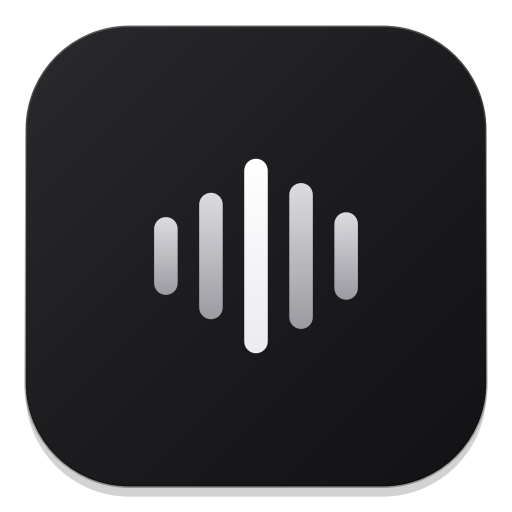

<p align="center">
  
</p>

<h1 align="center">Dictatly</h1>

<p align="center">
  <b>Fast, private, local speech-to-text dictation and transcription utility for Windows 10 & 11.</b>
</p>

<p align="center">
  <a href="https://github.com/21dkkk/Dictatly/actions/workflows/test.yml">
    
  </a>
  <a href="https://microsoft.com/windows">
    
  </a>
  <a href="https://python.org">
    
  </a>
  <a href="https://github.com/SYSTRAN/faster-whisper">
    
  </a>
  <a href="https://qt.io">
    
  </a>
  <a href="LICENSE">
    
  </a>
</p>

---

## Overview

**Dictatly** is an offline speech-to-text dictation and transcription client designed for Windows. Powered by local Whisper models running on GPU (CUDA) or CPU, it provides two workflows:

1. **Caret-Anchored HUD:** A floating, non-activating capsule widget (`WS_EX_NOACTIVATE`) that tracks your typing cursor and inserts recognized text directly into whichever application has focus (IDE, browser, messenger, terminal).
2. **History & Analytics Hub:** A multi-tab dashboard providing searchable transcription history, productivity analytics (volume, velocity, and source distribution), and a batch audio file transcription drop zone.

All processing runs locally on your device. Audio and transcribed text are stored in a local SQLite database and are never transmitted externally unless optional cloud post-processing is enabled.

```
                  ┌───────────────────────────────┐
                  │       ılı   [ ● ● ● ● ]       │  ← Floating Caret HUD
                  └───────────────┬───────────────┘
                                  ▼
           [ Active Caret in VS Code / Telegram / Browser ]
```

---

## System Architecture & Data Flow

```
┌──────────────────────────────────────────────────────────────────────────┐
│                             INPUT SOURCES                                │
│   Microphone (WASAPI RMS Stream)    │   Audio Files (.mp3, .wav, .m4a...)│
└───────────────────────┬───────────────────────────────┬──────────────────┘
                        │                               │
                        ▼                               ▼
┌──────────────────────────────────────────────────────────────────────────┐
│                         INFERENCE & TRANSCRIPTION                        │
│          faster-whisper Engine (NVIDIA CUDA FP16 / Multi-Core CPU)        │
└───────────────────────────────────────┬──────────────────────────────────┘
                                        ▼
┌──────────────────────────────────────────────────────────────────────────┐
│                         TEXT POST-PROCESSING PIPELINE                    │
│   • Smart Punctuation & Capitalization (Preserves Decimals and Clock)    │
│   • Custom Vocabulary Dictionary (e.g., 'пайтон' -> 'Python')             │
│   • Optional DPAPI-Secured Cloud AI Post-Processor                        │
└───────────────────────┬───────────────────────────────┬──────────────────┘
                        │                               │
                        ▼                               ▼
┌─────────────────────────────────┐   ┌────────────────────────────────────┐
│      ACTIVE CARET INJECTION     │   │      PERSISTENCE & ANALYTICS       │
│  Win32 AttachThreadInput +      │   │  SQLite Database (WAL Mode)        │
│  Hardware Scan Code Simulation  │   │  • Searchable History Archive      │
│  (Never steals window focus)    │   │  • Activity & Velocity Charts      │
└─────────────────────────────────┘   │  • Source Distribution Breakdown   │
                                      └────────────────────────────────────┘
```

---

## Features

- **Local GPU & CPU Acceleration:** Powered by [`faster-whisper`](https://github.com/SYSTRAN/faster-whisper). Uses NVIDIA CUDA FP16 for low-latency recognition, with automatic multi-threaded CPU fallback (`int8`).
- **Caret-Anchored HUD:** Floating dark glass widget centered dynamically above the active text cursor (`GetGUIThreadInfo`). Uses Win32 `WS_EX_NOACTIVATE` so it never steals focus from the target application.
- **Vector Iconography:** Scalable High-DPI SVG icons for UI controls and indicators, replacing emoji glyphs.
- **Productivity Analytics:** Visual tracking of daily word volume, speaking pace over time, and input source distribution.
- **Batch Audio Transcription:** Drag-and-drop workspace and file dialog selector supporting `.mp3`, `.wav`, `.m4a`, `.aac`, `.flac`, and `.ogg` files with automatic `.txt` export.
- **Low-Level Keyboard Hook:** Native `WH_KEYBOARD_LL` hook running in a dedicated message loop. Differentiates physical Left vs. Right modifiers (`Right Ctrl`, `Right Alt / AltGr`, `Right Shift`) and supports Toggle and Push-to-Talk modes.
- **Reliable Text Injection:** Restores target window focus, synchronizes with the Windows clipboard, and simulates `Ctrl+V` key events using hardware scan codes and thread input attachment (`AttachThreadInput`).
- **Smart Punctuation & Vocabulary:** Automatic sentence capitalization and punctuation spacing while protecting decimal numbers (`3.14`, `1,5`), clock times (`12:30`), and domain names (`google.com`). User-defined word replacement list for technical terminology.
- **DPAPI Key Storage:** Cloud API keys (Groq, OpenAI, Ollama) are encrypted locally using the Windows Data Protection API (`CryptProtectData`), tied strictly to the current Windows user account.
- **Audio Feedback & Gaming Pause:** Tactile audio cues on start/stop. System tray option to suspend hotkey interception during games or voice calls.
- **Bilingual Interface:** English and Russian localization across all windows, menus, charts, and notification dialogs.
- **Resource Management:** Chart animation and polling timers disconnect when windows are hidden (`hideEvent`), maintaining zero idle CPU usage.
- **Windows 11 24H2 Compatible:** Process management and single-instance handling use PowerShell CIM cmdlets, avoiding deprecated `wmic.exe`.

---

## Default Keyboard Shortcuts

| Shortcut | Action | Description |
| :--- | :--- | :--- |
| <kbd>Right Ctrl</kbd> | **Toggle Dictation** | Press once to start recording; press again to transcribe and insert text at active cursor. |
| <kbd>Right Shift</kbd> + <kbd>Right Ctrl</kbd> | **Alternative Finish** | Finishes recording and inverts the configured "Enter after insert" setting. |
| <kbd>Right Alt</kbd> + <kbd>Right Ctrl</kbd> | **History & Analytics Hub** | Opens transcript history, productivity analytics, and audio file import. |
| <kbd>Esc</kbd> | **Cancel Dictation** | Discards the current recording without inserting text. |

> [!TIP]
> All hotkeys can be rebound to custom keys or combinations in the **Settings** window.

---

## System Requirements

- **Operating System:** Windows 10 (Build 19041+) or Windows 11 (64-bit).
- **Python:** 3.10, 3.11, or 3.12 (64-bit).
- **Audio:** Any standard microphone or audio input device (WASAPI supported).
- **GPU (Recommended):** NVIDIA GPU with CUDA 12 for real-time speech recognition.
- **CPU (Fallback):** Multi-core CPU with int8 quantization works out of the box if a dedicated GPU is unavailable.

---

## Quick Start Guide

### 1. Clone the Repository

```powershell
git clone https://github.com/21dkkk/Dictatly.git
cd Dictatly
```

### 2. Set Up Python Virtual Environment

```powershell
python -m venv venv
.\venv\Scripts\activate
python -m pip install --upgrade pip
pip install -r requirements.txt
```

### 3. Launching Dictatly

- **Native Launcher (Zero Console Window):**
  Double-click `Dictatly.exe` (compiled C# wrapper that launches `pythonw.exe main.py`).
- **Silent VBS Script:**
  Double-click `Dictatly.vbs`.
- **Terminal Launch:**
  ```powershell
  .\run.bat
  # or: python main.py
  ```
- **Direct Settings Window:**
  ```powershell
  .\settings.bat
  # or: python main.py --settings
  ```
- **Direct History Window:**
  ```powershell
  .\history.bat
  # or: python main.py --history
  ```

---

## Repository Structure

```
Dictatly/
├── Dictatly.exe                # Native Windows launcher (no console window)
├── main.py                     # Application entry point & single-instance mutex
├── Dictatly.vbs                # Silent native Windows launcher script
├── requirements.txt            # Python dependencies (PySide6, faster-whisper, sounddevice)
├── run.bat                     # Terminal launcher
├── settings.bat                # Direct settings launcher
├── history.bat                 # Direct history launcher
├── resources/                  # Icons and application assets
│   ├── app_icon.ico            # Multi-resolution icon (256x256)
│   ├── app_icon.png            # 512x512 icon
│   ├── app_icon_64.png         # 64x64 icon
│   └── icons/                  # High-DPI SVG vector icons for UI controls
├── scripts/
│   └── build_launcher.py       # C# launcher compiler (Dictatly.exe)
├── src/
│   ├── app.py                  # Main coordinator and Qt lifecycle manager
│   ├── config.py               # JSON settings manager (%APPDATA%/Dictatly)
│   ├── localization.py         # RU / EN localization dictionary
│   ├── core/
│   │   ├── audio.py            # WASAPI audio capture and RMS volume stream
│   │   ├── autostart.py        # Windows Startup shortcut and registry manager
│   │   ├── database.py         # Thread-safe SQLite history storage (WAL mode)
│   │   ├── hotkey.py           # Win32 WH_KEYBOARD_LL low-level hook manager
│   │   ├── injector.py         # Thread-attached clipboard text injector
│   │   ├── security.py         # Windows DPAPI encryption (CryptProtectData)
│   │   ├── sound.py            # Mechanical key click audio cues
│   │   ├── text_postprocess.py # Punctuation and custom vocabulary engine
│   │   └── caret.py            # Active caret position tracker
│   ├── engine/
│   │   ├── transcriber.py      # Faster-Whisper ASR engine (CUDA / CPU)
│   │   └── ai_cleaner.py       # Optional OpenAI-compatible text post-processing
│   └── ui/
│       ├── hud.py              # Floating capsule HUD widget
│       ├── icons.py            # SVG renderer and High-DPI icon cache
│       ├── settings_window.py  # Settings window (audio, models, hotkeys)
│       ├── history_window.py   # History, analytics, and file batch transcription
│       ├── onboarding_dialog.py# First-run welcome and quick setup dialog
│       └── tray.py             # System tray icon and context menu
└── tests/
    ├── test_all.py             # Core component, security, and concurrency tests
    └── test_ui.py              # PySide6 headless UI tests
```

---

## Testing

Run the automated test suite to verify core modules, concurrency, and UI components:

```powershell
.\venv\Scripts\python.exe -m unittest discover tests -v
```

---

## Security & Privacy

1. **Local Audio Processing:** Audio captured by Dictatly is processed locally in memory and VRAM. Audio buffers are cleared immediately after transcription.
2. **DPAPI Key Storage:** API keys used for optional cloud cleanup are encrypted via Windows DPAPI (`CryptProtectData`).
3. **Single Instance Guarantee:** Enforced via a named Win32 global mutex (`Global\Dictatly_SingleInstance_Mutex`).
4. **PowerShell CIM Process Management:** Process restarts and terminations use native CIM cmdlets, compatible with Windows 11 24H2 where `wmic.exe` is deprecated.

---

## Author

Created and maintained by **[21dkkk](https://github.com/21dkkk)**.

---

## License

This project is licensed under the [MIT License](LICENSE).
